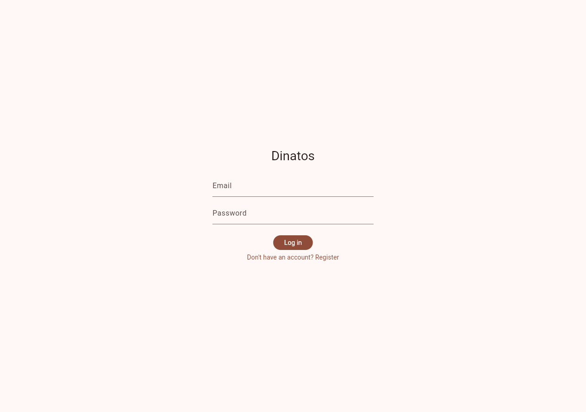
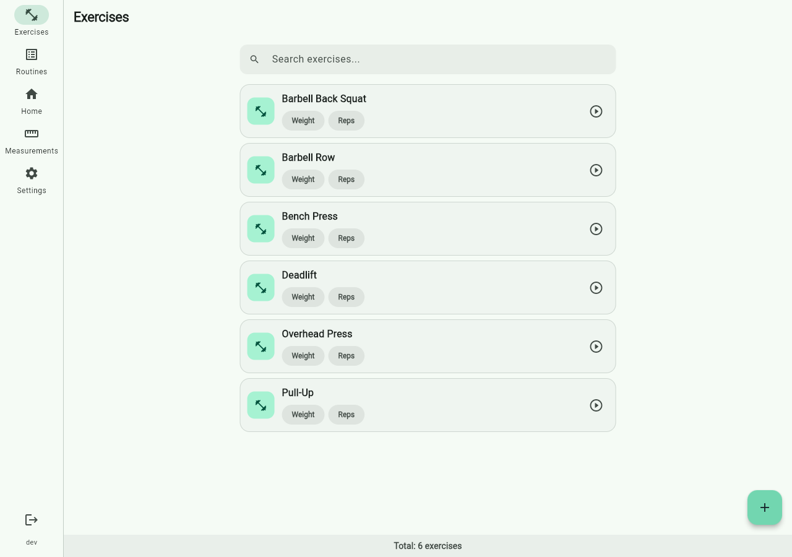
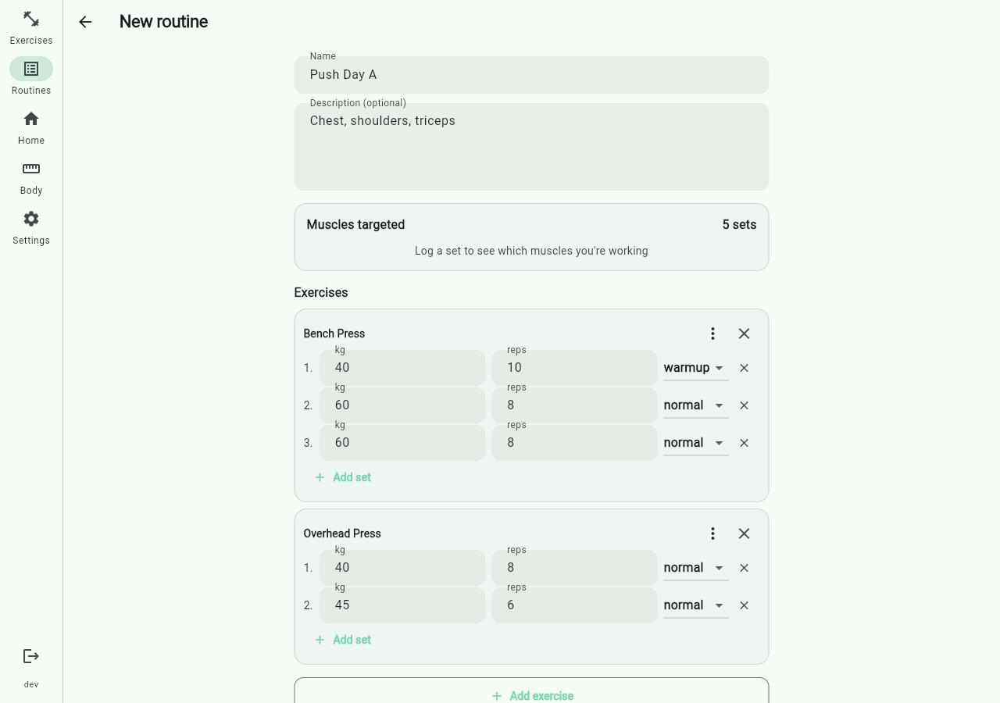
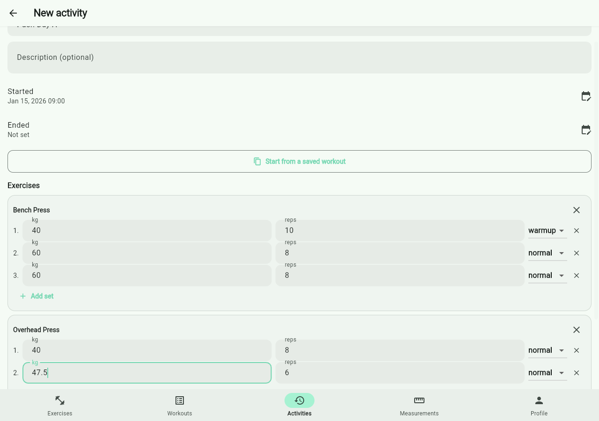
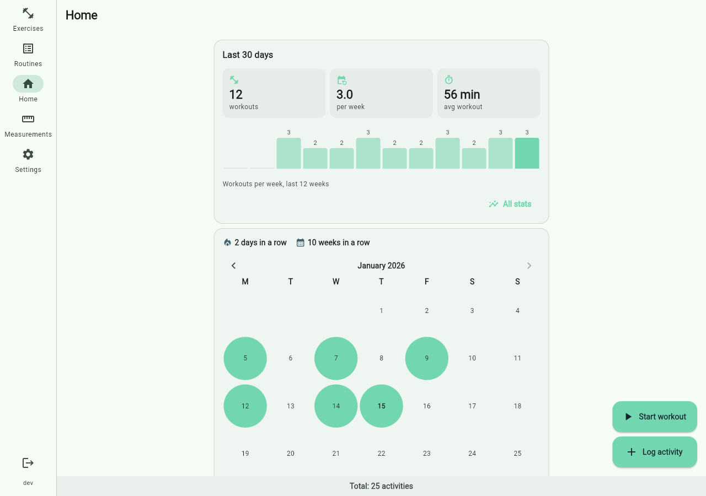
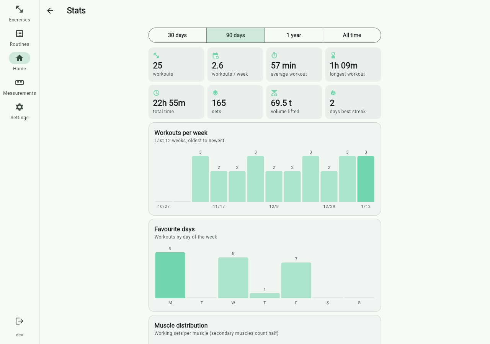
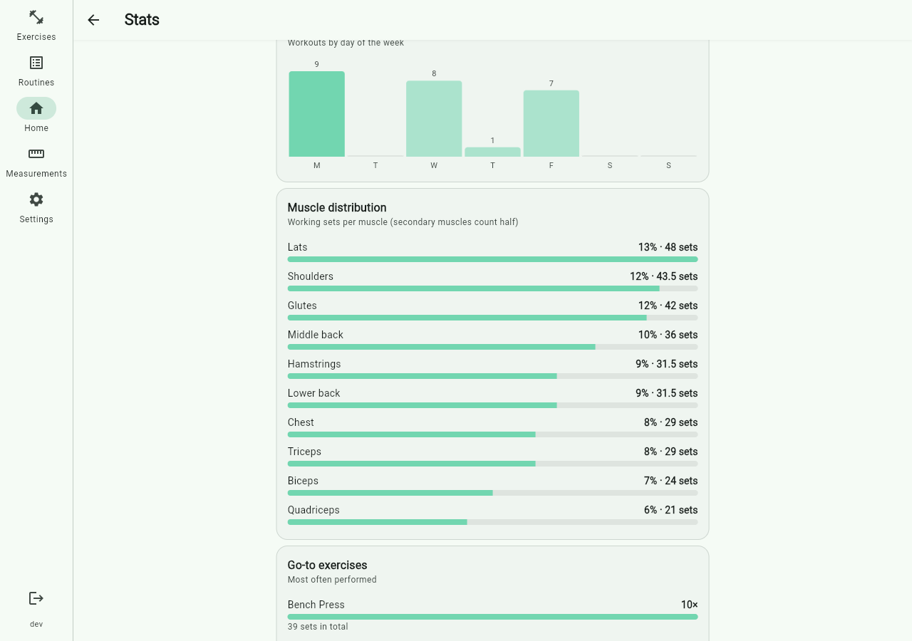
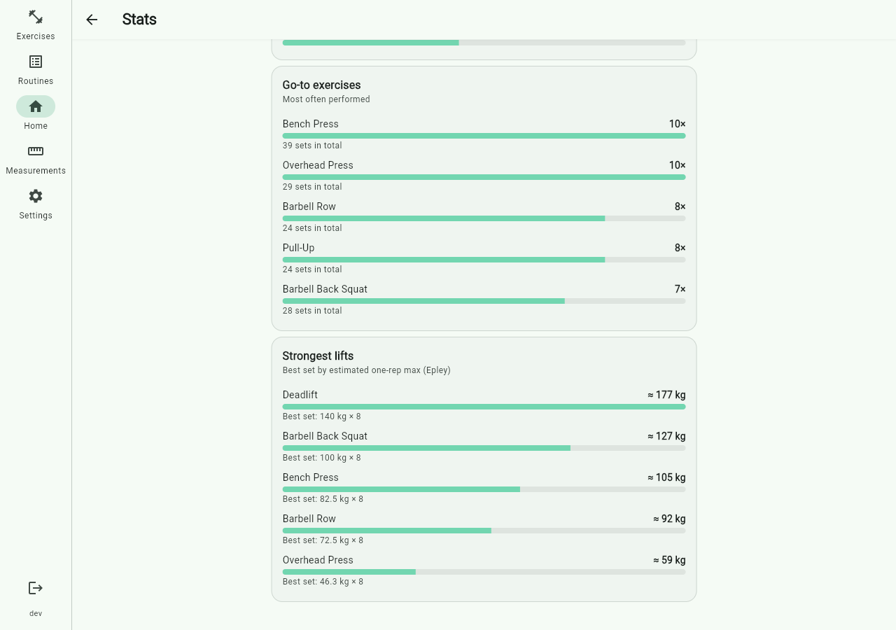

# Dinatos

A self-hosted workout tracker: exercises, routines, and the activities you
log against them. Inspired by Hevy, built to run on your own homelab.

**Status:** a FastAPI + async SQLAlchemy backend (multi-user accounts with
session-based auth, exercises, routines, activities, a profile, body
measurements, a Hevy CSV importer) and a Flutter frontend against it (web,
Android, and Linux desktop) that also charts your training: frequency,
workout time, muscle split, go-to exercises and best lifts.

## Screenshots

<!-- screenshots:start -- generated by screenshots/generate.py, do not edit by hand -->
<table>
<tr>
<td align="center" width="50%">
<br>
<sub>Signing in</sub>
</td>
<td align="center" width="50%">
<br>
<sub>The exercise catalog</sub>
</td>
</tr>
<tr>
<td align="center" width="50%">
<br>
<sub>Building a saved routine</sub>
</td>
<td align="center" width="50%">
<br>
<sub>Logging an activity from it</sub>
</td>
</tr>
<tr>
<td align="center" width="50%">
<br>
<sub>Home: the last 30 days at a glance</sub>
</td>
<td align="center" width="50%">
<br>
<sub>Stats: frequency, duration and volume</sub>
</td>
</tr>
<tr>
<td align="center" width="50%">
<br>
<sub>Stats: muscle split and go-to exercises</sub>
</td>
<td align="center" width="50%">
<br>
<sub>Stats: strongest lifts</sub>
</td>
</tr>
</table>
<!-- screenshots:end -->

Generated against a real backend and a real frontend build, not mocked --
see [`screenshots/`](screenshots/). `just screenshots generate` regenerates
them.

## Quickstart

```bash
cp .env.example .env   # then edit it -- see the file for what to set
docker compose up -d    # Postgres + the app (API and web UI, same origin)
```

Then open `http://127.0.0.1:8000` in a browser -- that's the app itself, no
separate frontend to build or serve. See
[Running your own instance](https://bergercookie.github.io/dinatos/deploy/index.html)
for configuration, upgrades/backups, and native (Android/Linux) clients.

## Using it

Already have access to a running instance and just want to log workouts,
track measurements, or import your history from Hevy? See
[Using Dinatos](https://bergercookie.github.io/dinatos/user-guide/index.html).

## Contributing

Changing the code itself starts at [`CONTRIBUTING.md`](CONTRIBUTING.md) --
Devbox + `just` are the supported way to interact with this repo. See
[Contributing](https://bergercookie.github.io/dinatos/development/index.html)
and [Architecture](https://bergercookie.github.io/dinatos/architecture/index.html)
for everything beyond the quick version.

## Releases

Pushing a `v*` tag builds and publishes a Docker image with the backend and
web UI together (to `ghcr.io/bergercookie/dinatos`), a Linux
`.deb`/`.AppImage`, and an Android APK -- see the
[Releases page](https://github.com/bergercookie/dinatos/releases) for the
latest. The native builds ask for the backend's URL on first launch (or
later, from the settings screen), so one release works against anyone's own
homelab instance rather than whichever one built it.

## Documentation

Rendered at [the GitHub Pages site](https://bergercookie.github.io/dinatos/)
(once published), and readable in place under [`docs/`](docs/).

## Security

See [SECURITY.md](SECURITY.md) for supported versions and how to report a
vulnerability privately.

## License

[MIT](LICENSE) -- (c) Nikos Koukis.
