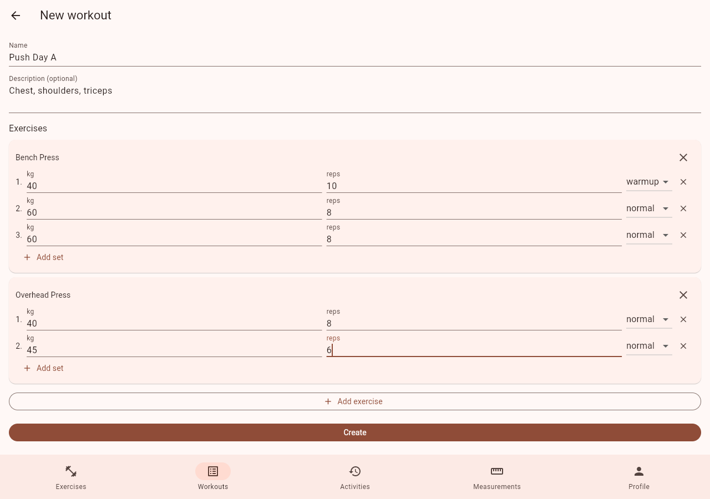
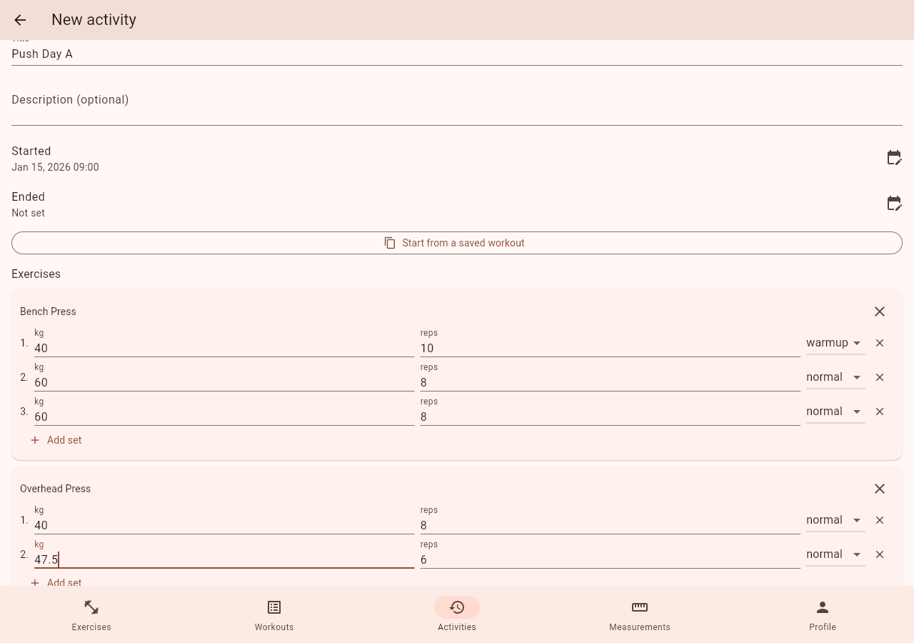

# Dinatos

A self-hosted workout tracker: exercises, workouts, and the activities you
log against them. Inspired by Hevy, built to run on your own homelab.

**Status:** a FastAPI + async SQLAlchemy backend (multi-user accounts with
session-based auth, exercises, workouts, activities, a profile, body
measurements, a Hevy CSV importer) and a Flutter frontend against it (web,
Android, and Linux desktop). See [`docs/architecture.md`](docs/architecture.md)
for the API surface, the app's structure, and build order.

## Screenshots

<!-- screenshots:start -- generated by screenshots/generate.py, do not edit by hand -->
<table>
<tr>
<td align="center" width="50%">
<br>
<sub>Signing in</sub>
</td>
<td align="center" width="50%">
<br>
<sub>The exercise catalog</sub>
</td>
</tr>
<tr>
<td align="center" width="50%">
<br>
<sub>Building a saved workout</sub>
</td>
<td align="center" width="50%">
<br>
<sub>Logging an activity from it</sub>
</td>
</tr>
</table>
<!-- screenshots:end -->

Generated against a real backend and a real frontend build, not mocked --
see [`screenshots/`](screenshots/). `just screenshots update` regenerates
them; CI (`just screenshots check`) fails if they've drifted from what's
committed here.

## Quickstart

```bash
cp .env.example .env   # then edit it -- see the file for what to set
just dev                # Postgres + backend + frontend, together
```

Opens at `http://127.0.0.1:8081`; log in with whatever you set
`DINATOS_ADMIN_EMAIL`/`DINATOS_ADMIN_PASSWORD` to in `.env` (that account is
created automatically on first startup). See
[`docs/getting-started.md`](docs/getting-started.md) for running each piece
on its own instead, and for what needs to already be installed (Docker, the
Flutter SDK).

```bash
just install   # create the backend virtualenv
just check     # lint, test, build docs -- what CI runs (backend + docs)
```

`just` on its own lists every available recipe. Each package directory
(`backend/`, `docs/`, `frontend/`) also owns its own self-sufficient
`justfile`, runnable directly, e.g. `cd backend && just test`. The frontend
needs the Flutter SDK, not just Python/uv, so `just frontend check` is
separate from the root `just check` -- see AGENTS.md.

## Releases

Pushing a `v*` tag builds and publishes a backend Docker image (to
`ghcr.io/bergercookie/dinatos-backend`), a Linux `.deb`/`.AppImage`, and an
Android APK -- see the [Releases page](https://github.com/bergercookie/dinatos/releases)
for the latest, and [`docs/architecture.md`](docs/architecture.md)'s
"Distribution" section for exactly what each one is and how it's built.
Every client build asks for the backend's URL on first launch (or later,
from the profile screen), so one release works against anyone's own
homelab instance rather than whichever one built it.

## Documentation

Rendered at [the GitHub Pages site](https://bergercookie.github.io/dinatos/)
(once published), and readable in place under [`docs/`](docs/) and
[`AGENTS.md`](AGENTS.md).
